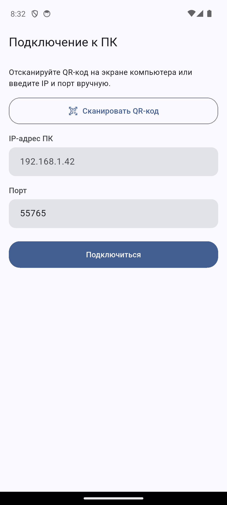

# Инструкция: Выключатель ПК

Управление питанием домашнего/рабочего ПК с телефона — выключение, перезагрузка,
сон, гибернация, блокировка экрана, таймеры отложенного выключения, громкость,
медиаклавиши и тачпад (мышь + клавиатура) прямо с телефона. Работает только в
пределах вашей локальной Wi-Fi сети — без облака, без регистрации, без интернета.

## Содержание

- [Что нужно](#что-нужно)
- [Установка на ПК (Windows)](#установка-на-пк-windows)
- [Установка на телефон (Android)](#установка-на-телефон-android)
- [Первое подключение (сопряжение)](#первое-подключение-сопряжение)
- [Возможности приложения](#возможности-приложения)
- [Если ПК был выключен, а войти в Windows некому](#если-пк-был-выключен-а-войти-в-windows-некому)
- [Решение проблем](#решение-проблем)
- [Безопасность](#безопасность)

## Что нужно

- Windows 10/11 на ПК, которым хотите управлять.
- Android-телефон.
- Оба устройства — **в одной Wi-Fi сети** (не гостевой, без изоляции клиентов).

## Установка на ПК (Windows)

1. Скачайте `RemoteShutdownAgent-Setup-x.x.x.exe` из
   [Releases](https://github.com/USERNAME/remote_shutdown/releases) этого репозитория.
2. Запустите — установщику один раз потребуются права администратора (UAC), это
   нормально: он ставит службу Windows, которая работает в фоне и переживает
   перезагрузку ПК (см. ниже).
3. Установщик сам:
   - ставит и запускает службу **Remote Shutdown Agent** (работает в фоне
     постоянно, независимо от того, вошли ли вы в Windows);
   - добавляет значок в системный трей — оттуда открываются настройки.
4. При первом запуске автоматически генерируется случайный PIN для сопряжения —
   он понадобится на следующем шаге. Посмотреть его снова: значок в трее →
   **Настройки** → вкладка **Сопряжение** → кнопка «Показать».

> Windows SmartScreen может показать предупреждение «Windows защитила ваш
> компьютер» — это обычная реакция на новый, не имеющий репутации
> исполняемый файл, не признак проблемы. Нажмите «Подробнее» → «Всё равно
> выполнить».

## Установка на телефон (Android)

1. Скачайте `app-arm64-v8a-release.apk` (подходит для подавляющего большинства
   телефонов; `armeabi-v7a` — для очень старых устройств) из
   [Releases](https://github.com/USERNAME/remote_shutdown/releases).
2. Откройте файл на телефоне. Android спросит разрешение на установку из
   неизвестного источника — разрешите только для этого файла (это ожидаемо:
   приложение не публикуется в Google Play).
3. Установите и откройте.

## Первое подключение (сопряжение)

1. На ПК откройте настройки агента (значок в трее → Настройки) — там показан
   QR-код с адресом ПК, портом и PIN.
2. На телефоне нажмите **«Сканировать QR-код»** и наведите камеру на экран ПК —
   все поля заполнятся сами.
3. Либо введите вручную: IP-адрес и порт ПК (видны там же, на вкладке
   «Сопряжение») и PIN.
4. Нажмите «Подключиться», на следующем экране введите PIN и подтвердите.

Готово — телефон запомнит этот ПК и будет открывать его дашборд сразу при
запуске.

## Возможности приложения

**Основные действия** — выключение (крупная кнопка), перезагрузка, сон,
гибернация, блокировка экрана.

**Таймеры выключения** — быстрые пресеты (15/30/60 мин, 1.5/2/3 часа) и кнопка
«Своё время» — выбор конкретного часа. Активные таймеры видны внизу дашборда,
их можно отменить или отложить на 10 минут.

**Громкость и медиа** — громче/тише/без звука, плюс play/pause и
следующий/предыдущий трек (эмуляция медиаклавиш — работает с любым плеером на
ПК).

**Тачпад** (нижнее меню «Тачпад») — курсор мыши (ведите пальцем по площадке),
левый/правый клик, ввод текста и основные клавиши (Enter, Backspace, Esc, Tab,
стрелки).

**Несколько ПК** — иконка «Мои ПК» в шапке дашборда: можно сопрячь телефон с
несколькими компьютерами и переключаться между ними.

## Если ПК был выключен, а войти в Windows некому

Начиная с версии 2.0, агент работает как служба Windows и включается вместе с
ПК ещё до входа пользователя в систему — поэтому **выключение/перезагрузка/сон
работают всегда**, даже если на компьютере никто не залогинен.

Громкость, медиаклавиши, блокировка экрана и тачпад физически требуют открытого
рабочего стола — если на ПК никто не вошёл в систему, приложение покажет
понятную ошибку «На ПК никто не вошёл в систему», а не зависнет молча.

## Решение проблем

**Не подключается / «Connection refused»**
- Телефон и ПК точно в одной Wi-Fi сети?
- На ПК: Настройки → вкладка «Общие» → «Добавить правило в брандмауэр» (разово
  попросит подтверждение UAC).
- Значок агента виден в трее? Если нет — посмотрите на стрелочку «Показать
  скрытые значки» (`^`) справа на панели задач, Windows иногда прячет туда
  новые иконки.

**PIN не подходит**
- PIN, сгенерированный автоматически, действует, пока вы не зададите новый —
  посмотреть текущий: Настройки → Сопряжение → «Показать».

**После обновления приложения на телефоне установка зависает**
- Известная особенность системного установщика Android при обновлении поверх
  старой версии — переподключите Wireless debugging (если ставите через adb)
  либо переустановите (`adb install -r`).

**«На ПК никто не вошёл в систему»** при попытке настроить громкость/медиа/
тачпад/блокировку — см. раздел выше, это не ошибка, а ожидаемое ограничение:
войдите в Windows на ПК и повторите.

**Иконка агента в Windows выглядит размыто/старая после обновления**
- Explorer кэширует иконки по пути к файлу — переустановка это исправляет
  автоматически (инсталлятор сам сбрасывает кэш иконок).

## Безопасность

- Никакого облака: телефон общается с ПК напрямую по локальной сети, HTTPS с
  самоподписанным сертификатом, закреплённым при первом сопряжении
  (trust-on-first-use).
- Каждая команда подписывается HMAC общим секретом, полученным при сопряжении
  — посторонний в той же Wi-Fi сети не может просто угадать/подделать запрос.
- Сопряжённые устройства можно отозвать в любой момент: Настройки → вкладка
  «Устройства» → «Отозвать доступ».
- Подробная модель угроз — [docs/security.md](security.md).

---

Исходный код и новые версии — [https://github.com/USERNAME/remote_shutdown](https://github.com/USERNAME/remote_shutdown).
